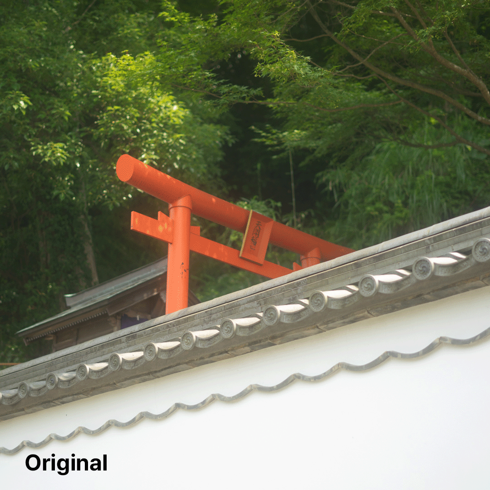

# 🖥️ image-post-processing
HDR, Histogram, Sharpen, Gamma correction, Bloom, Blur, Contour detection
#### **Problem what I'm trying to solve:**
- ```Image Filtering```
- Gray scale algorithms.
- Blur algorithms.
- Sharpen algorithms.
- Bloom
- Contour detection
- Gamma correction (RAW to sRGB)
- HDR(Dynamic Range Compression)
- Noise Reduction
- Histogram viewer, Interactive tools

## Install:
`image-post-processing` has an automatic installer.
Copy the line bellow to your console and execute it.
It will automatically download the repo, create the necessary folders.

```
bash -c "$(curl -fsSL https://raw.github.com/jeekpark/image-post-processing/main/install.sh)"
```

## Execute:
Run the command below.
```
cd ./image-post-processing
```
```
./imagepp <file.jpg>
```

## Features:

> ### Grayscale convert
> > #### Average method
> > Calculates the average of the Red, Green, and Blue (RGB) values of each pixel.<br>
```(red + green + blue) / 3```<br>
>
> > #### Weighted or luminosity method
> > Human eyes are more sensitive to green. So diffrent weights are appilied to the RGB values.<br>
```(0.299 * red) + (0.587 * green) + (0.114 * blue)```<br>
>
> > #### Desaturation method
> > This method takes the average of the maximum and minimum values among the RGB components of each pixel.<br>
```(max(red, green, blue) + min(red, green, blue)) / 2```
>
> > #### Single color channel
> > This method simply uses one color channel (such as Red or Green) for the black and white conversion.<br>
>
> > #### Comparison of Four Types
> > Luminosity method is the best.<br>
> > 

### 🏎️ Blur
#### Box
#### Gaussian


