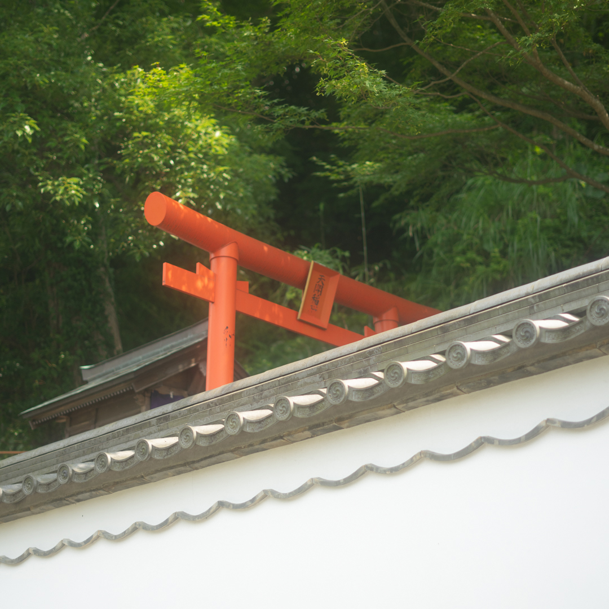
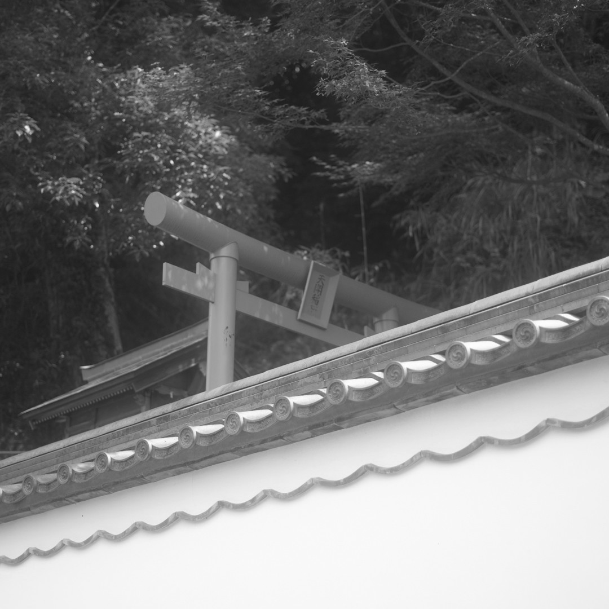
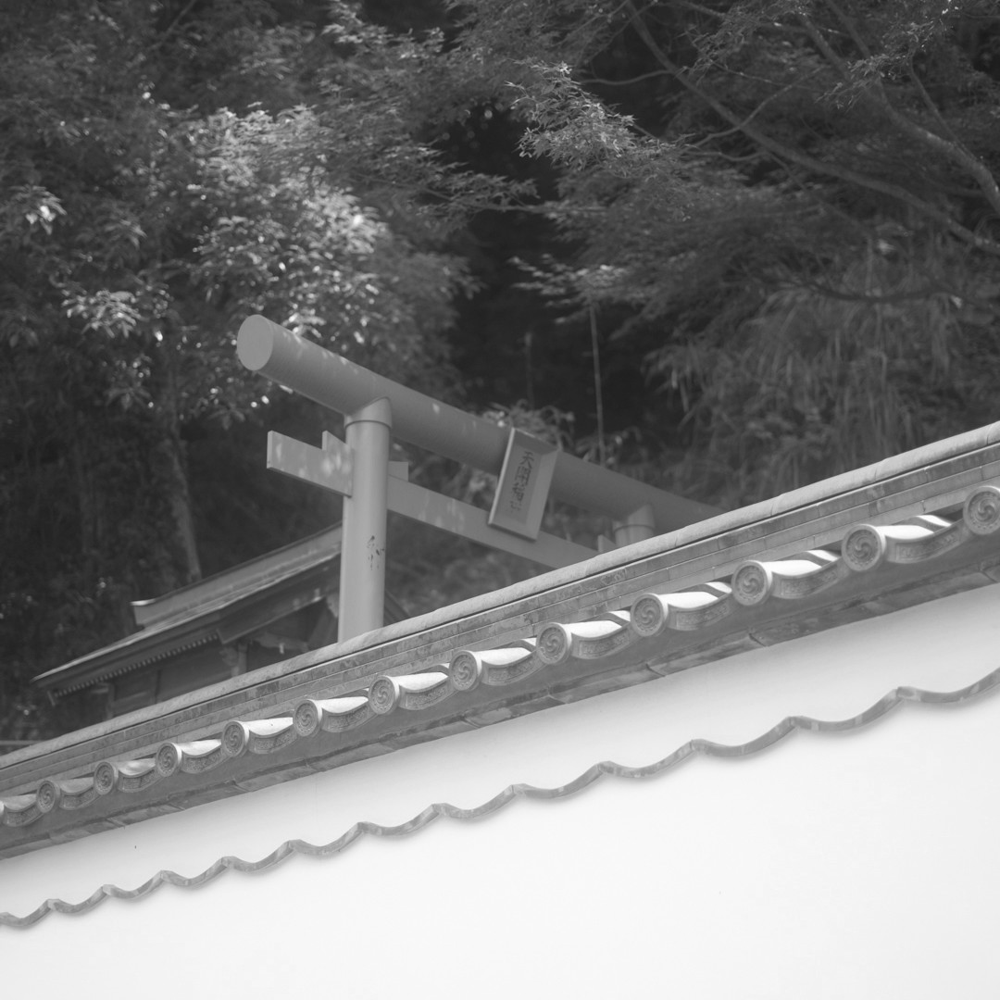
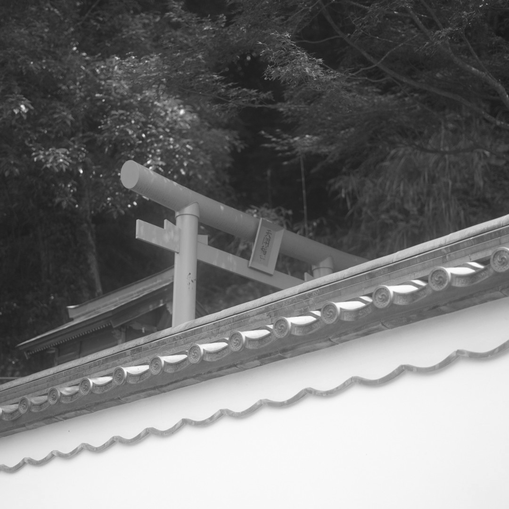
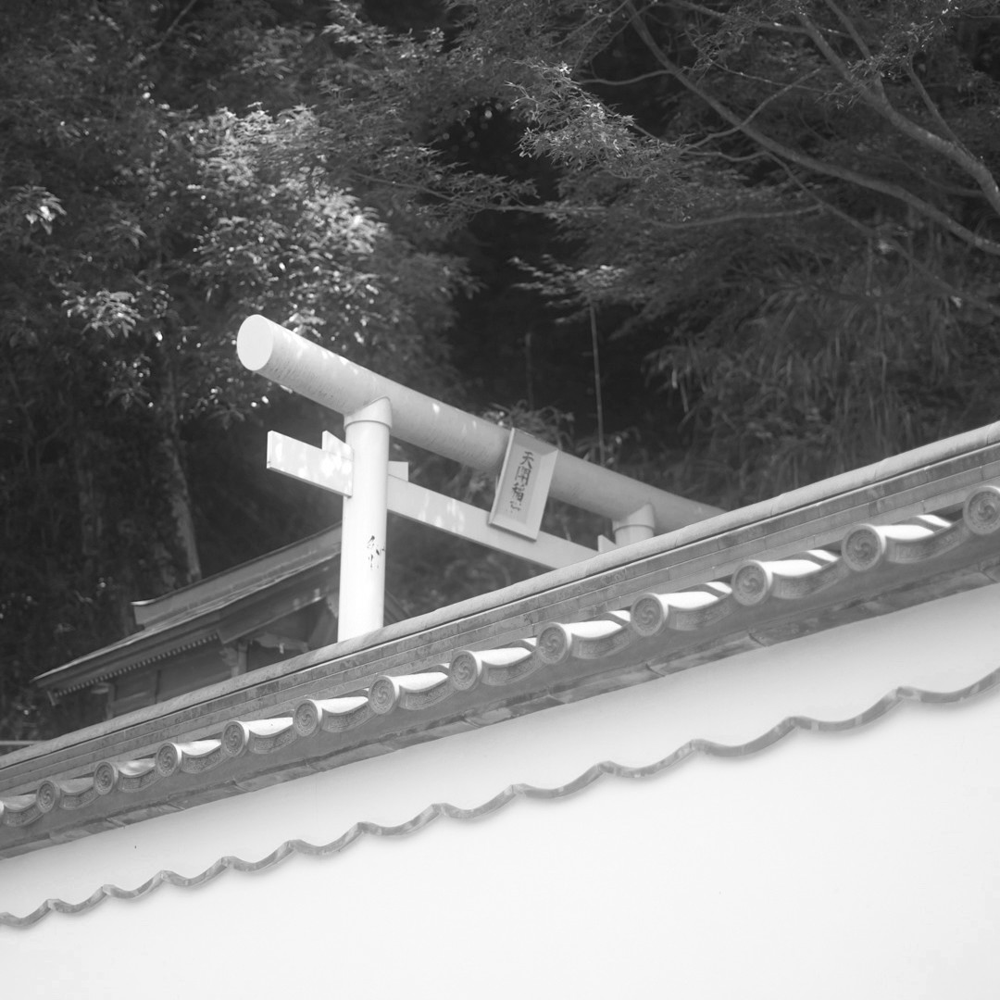

# 🖥️ image-post-processing
HDR, Histogram, Sharpen, Gamma correction, Bloom, Blur, Contour detection


## Features:

### 🖤 Black & white convert

#### Original image
> Torii


#### Average method
> Calculates the average of the Red, Green, and Blue (RGB) values of each pixel.


#### Weighted or luminosity method
> Human eyes are more sensitive to green. So diffrent weights are appilied to the RGB values.
```(0.299 * red) + (0.587 * green) + (0.114 * blue)```

#### Desaturation method
> This method takes the average of the maximum and minimum values among the RGB components of each pixel.

#### Single color channel
> This method simply uses one color channel (such as Red or Green) for the black and white conversion.


#### Compare
> Luminosity method is the best.


### 🏎️ Blur
#### Box
#### Gaussian


## Install:
`image-post-processing` has an automatic installer.
Copy the line bellow to your console and execute it.
It will automatically download the repo, create the necessary folders.

```
bash -c "$(curl -fsSL https://raw.github.com/jeekpark/image-post-processing/main/install.sh)"
```

## Execute:
Run the command below.
```
cd ./image-post-processing
```
```
./ipp
```
